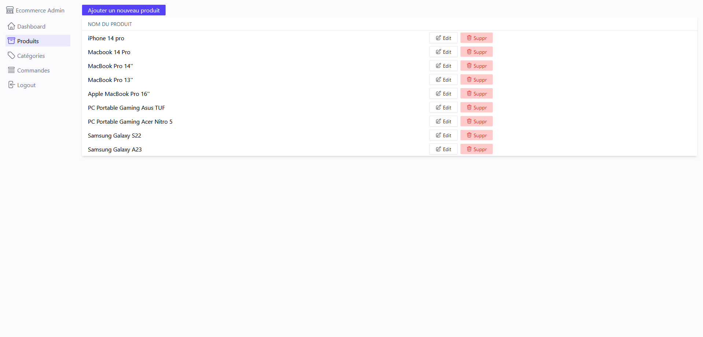
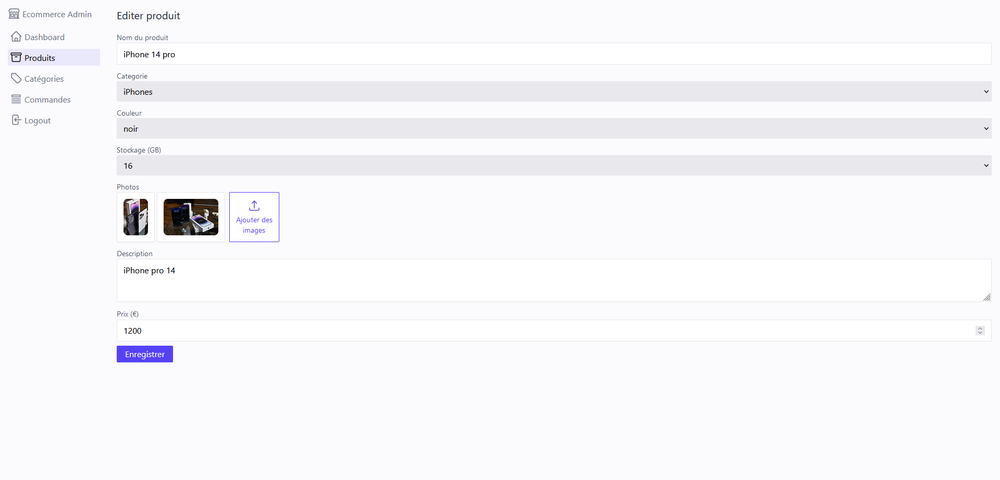
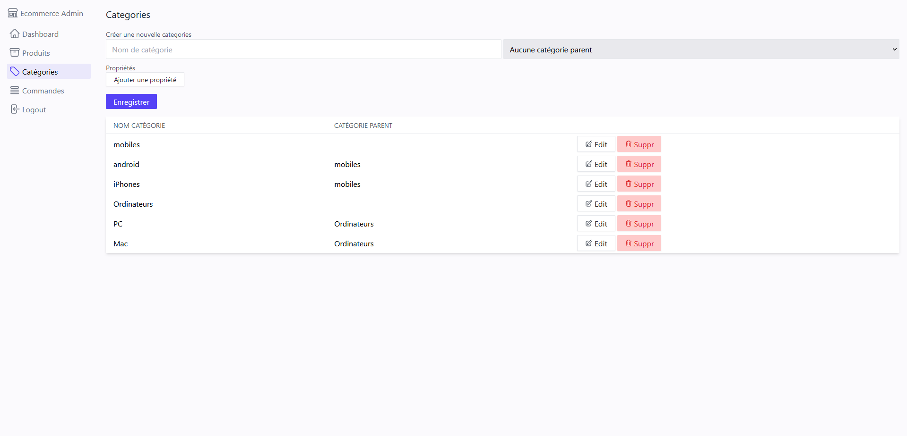
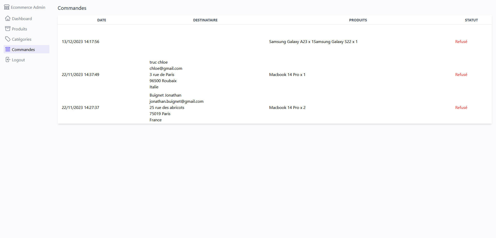

# 🛍️ E-Commerce Administration 🛠️

## Description

Bienvenue sur le projet d'administration pour la gestion du site e-commerce vitrine. Ce projet permet d'administrer facilement le contenu du site en ajoutant, modifiant ou supprimant des produits et des catégories. De plus, il offre une visibilité sur les commandes passées par les clients, ainsi que le statut du paiement via Stripe.

**Liens vers le panneau d'Administration :** [E-Commerce Administration](https://ecommerce-administration.vercel.app/)  
Prévoir quelques ralentissement dû à la gratuité des services d'hébergement utilisés.

## Fonctionnalités

- Ajout, modification et suppression simple des produits et des catégories.
- Ajout et suppressions d'images via le service S3 d'AWS.
- Suivi des commandes passées par les clients.
- Statut du paiement via l'intégration de Stripe.

## Authentification

L'authentification est prise en charge via NextAuth et Google. Actuellement, cette fonctionnalité est désactivée pour permettre à chacun d'utiliser le projet plus facilement.

## Technologies Utilisée

- ReactJS ⚛️
- NextJS 🚀
- MongoDB 🍃
- Tailwind CSS 🎨
- Mongoose 🏠
- AWS ☁️
- Stripe 💳

## Aperçu

Tous les produits :

Un produit :

Les categories :

Les commandes et leur statut de paiement :

